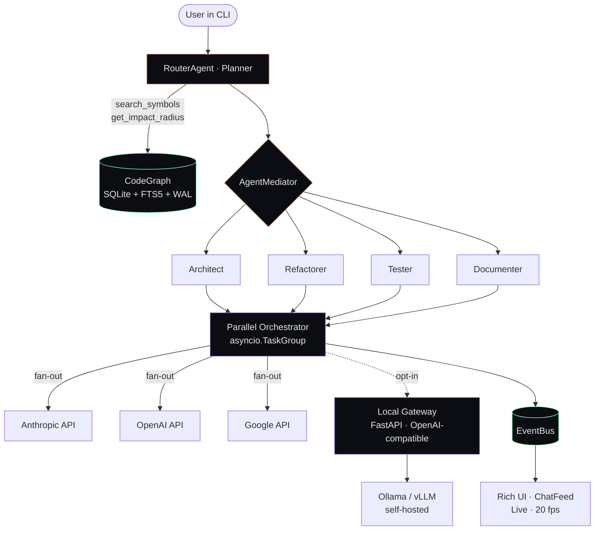

<div align="center">

<br>

```

        ❖   ι v y c o d e
        ────────────────────────────────────────────
        multi-agent CLI for engineers who refuse to wait

```

<br>

**Three frontier models. One chat feed. Zero context bloat.**

Parallel orchestration of Claude · GPT · Gemini in a single Rich terminal,
grounded in a local semantic graph of your codebase.

<br>

[](LICENSE)
[](https://www.python.org/)
[](#roadmap)
[](PROMPT_SPEC.md)

<br>

[**Quick start**](#-quick-start) ·
[**Architecture**](#-architecture) ·
[**Design system**](#-design-system) ·
[**Spec**](PROMPT_SPEC.md) ·
[**Roadmap**](#-roadmap)

<br>

---

</div>

## What it looks like

A single scrollable chat feed where every model is a speaker with its own color bar, glyph, and identity. Parallel streaming, no fighting for screen space, no three-column hell.

```
 ❖  ι v y c o d e
 ──────────────────────────────────────────

 project   ~/code/myapp on feat/oauth
 graph     1,247 symbols · fresh
 models    ◆ claude   ▲ gpt   ● gemini


 ✦  router                                          14:32:01 · ✓ plan ready

   plan ready · 4 steps · risk=low · est 3.2k tok

   ┌─ ▸ Search · 12ms ──────────────────────┐
   │ "UserAuth" → 3 matches                 │
   └────────────────────────────────────────┘
   ┌─ ▸ Impact · 27ms ──────────────────────┐
   │ "auth.login.authenticate" → risk 0.42  │
   └────────────────────────────────────────┘


 ▏ ◆  claude opus 4.7                                14:32:02 · ✓ done
 ▏
 ▏  Three epicenters in the auth flow. Refactor order matters —
 ▏  middleware first, then session refresh, then login route.
 ▏
 ▏  ┌─ python ─────────────────────────────────────────── [c] ─┐
 ▏  │  1  async def jwt_validate(req: Request) -> User:        │
 ▏  │  2      token = req.headers.get("authorization")         │
 ▏  │  3      ...                                              │
 ▏  └──────────────────────────────────────────────────────────┘
 ▏
 ▏  in 1,204 → out 318 · TTFB 412ms · $0.0042


 ▏ ▲  gpt-5.5 xhigh                                  14:32:02 · ⏳ 187t
 ▏
 ▏  Disagree. Start with login route — it has the fewest
 ▏  callers and lets you iterate without breaking sessions...
 ▏

 ─────────────────────────────────────────────────────────────────────
 ◆ claude / architect  ·  graph 1247 sym · fresh  ·  ctx ████████░░░░ 42%
 > █
```

> [!NOTE]
> Pre-alpha. The CLI is being assembled from the [25-section production spec](PROMPT_SPEC.md). Visuals above are the locked design — implementation is in progress.

<br>

## Current implementation

`v0.1.0-foundation` is the first runnable stage.

Implemented:

- project metadata and strict tool configuration
- immutable Pydantic envelope contracts
- runtime settings with `IVYCODE_` environment support
- minimal Typer entrypoint
- `ivycode doctor`

Run:

```bash
python -m ivycode doctor
```

Verify:

```bash
python -m pytest -q
python -m ruff check .
python -m mypy ivycode
python -m ivycode doctor
```

<br>

## ✦ Why ivycode

<table>
<tr>
<td width="50%" valign="top">

### Parallel intelligence
Stream **Claude**, **GPT** and **Gemini** at the same time, into the same conversation. Compare, vote, pick. The orchestrator (`Router`) plans, dispatches, and aggregates — you read the conversation, not three terminals.

</td>
<td width="50%" valign="top">

### Semantic context, not raw files
A local `CodeGraph` (SQLite + FTS5 + WAL) indexes your repo and answers `search_symbols`, `get_impact_radius`, `get_framework_routes` in milliseconds. Agents receive `SymbolBrief` references — **~30–40% fewer input tokens** than dumping source.

</td>
</tr>
<tr>
<td width="50%" valign="top">

### One feed, three speakers
No three-column carnage. Every reply is a panel with a colored left bar (`▏◆` Claude · `▏▲` GPT · `▏●` Gemini). Vertical chat. Syntax-highlighted code. Markdown that actually renders.

</td>
<td width="50%" valign="top">

### Real engineering primitives
`asyncio.TaskGroup` for fan-out · `httpx.AsyncClient` with HTTP/2 pooling · Pydantic v2 strict schemas as the only inter-agent contract · single-writer SQLite thread + `aiosqlite` read pool · graceful cancellation on `Ctrl+C`.

</td>
</tr>
</table>

<br>

## ⚡ Quick start

> [!WARNING]
> Pre-alpha. Commands below describe the target UX from the spec. Not all are runnable yet — track progress in [Roadmap](#-roadmap).

```bash
# install (planned)
pipx install ivycode

# configure providers (interactive wizard)
ivycode init

# enter chat with three models in parallel
ivycode chat -m claude -m gpt -m gemini

# one-shot plan without execution
ivycode plan "refactor auth flow to OAuth, keep backwards-compat"

# rebuild the local semantic graph
ivycode index --force

# diagnose providers / graph / keys
ivycode doctor
```

### Inside the chat

| Prefix | Meaning | Example |
|---|---|---|
| `/` | Slash commands | `/compact`, `/pin`, `/fresh`, `/model`, `/context` |
| `@` | File paths with glob | `@src/auth/login.py`, `@src/**/*.ts` |
| `#` | Symbols from CodeGraph | `#authenticate_user` |
| `!` | Shell command, in-place | `!pytest tests/auth/` |
| `⌘P` | Command Palette (fuzzy) | switch model, pin, reindex, dashboard |
| `↑/↓` | History · `Tab` fold · `Enter` expand a tool card |

<br>

## ✦ Architecture



**Six layers, strict boundaries:**

1. **CLI** — Typer + prompt_toolkit, slash/`@`/`#`/`!`/palette router.
2. **Agents** — Router (planner) + SubAgents (Architect / Refactorer / Tester / Documenter), Mediator pattern. Only contract between them: Pydantic envelopes.
3. **Providers** — Abstract Factory + `WireCodec` per wire-protocol (`openai_chat`, `anthropic_messages`, `google_generate_content`, `openai_responses`). One `AsyncClient` per profile, HTTP/2 multiplexing.
4. **CodeGraph** — Façade over a local SQLite index. Single-writer thread + `aiosqlite` read pool. Watchdog reindex with 300 ms debounce.
5. **Orchestration** — `asyncio.TaskGroup` for fan-out, structured cancellation, retry with exponential backoff via Tenacity.
6. **UI** — Rich `Layout` (chat feed + sidebar + status bar), `Live(refresh_per_second=20)`, EventBus subscribers, per-model `MessagePanel` with colored left bar.

Full architecture and Pydantic schemas: **[PROMPT_SPEC.md](PROMPT_SPEC.md)** (25 sections, ~3 500 lines).

<br>

## ✦ Design system

> Mood: **Quiet Luxury Terminal**. Premium restraint, not synthwave neon.

<table>
<tr>
<td width="33%" valign="top" align="center">

**Palette**

```
bg.base       #0B0D12
bg.elevated   #11141B
text.primary  #E6E6E6
text.dim      #6B7280
accent.warm   #E5A98C
accent.mint   #7CFFB2
accent.violet #A78BFA
warn          #FFB070
error         #FF6B6B
```

</td>
<td width="33%" valign="top" align="center">

**Speakers**

```
◆  Claude    #C97B5C
▲  GPT       #10A37F
●  Gemini    #8AB4F8
✦  Router    #A78BFA
✮  Graph     #7CFFB2
◈  Context   #E5A98C
⚠  Error     #FF6B6B
```

</td>
<td width="33%" valign="top" align="center">

**Voice**

Sharp. Engineering. Facts and numbers.

```
plan ready · 4 steps · risk=low
reindex 23/40 · 1.4s
ctx compacted · -3,840 tok
provider · anthropic 429
dispatch · architect · 6k tok
```

</td>
</tr>
</table>

**Density:** Roomy · padding `(1, 2)` · one blank line between messages.
**Motion:** Living · custom spinners (`ivy-pulse`, `ivy-orbit`, `ivy-stream`) · respects `IVYCODE_MOTION=static`.
**Input:** `/` commands · `@` files · `#` symbols · `!` shell · `⌘P` palette · `Tab` fold · `Enter` expand.

<br>

## ✦ Features

<table>
<tr>
<td width="50%" valign="top">

#### 🧠 Multi-agent orchestration
Router plans with strict Pydantic `ExecutionPlan` (validated, retried, schema-enforced). SubAgents execute via Mediator. Parallel compare for ambiguous decisions, deterministic dispatch for refactors.

</td>
<td width="50%" valign="top">

#### 🗂️ Semantic CodeGraph
Local SQLite + FTS5 index of every symbol, route, caller graph. `get_impact_radius()` traces transitive dependencies. Watchdog reindex on save. ~30–40% token savings vs raw file dumps.

</td>
</tr>
<tr>
<td width="50%" valign="top">

#### 🎨 Rich UI with parallel streaming
Single scrollable feed, models as colored speakers. `Live` redraw at 20 fps. Syntax-highlighted code with copy/save/run actions. Inline tool cards. Adaptive status bar.

</td>
<td width="50%" valign="top">

#### 🔌 Pluggable transports
Abstract `WireCodec` per protocol. Same agent code targets official APIs, Ollama, vLLM, LiteLLM, or your local gateway. Custom `base_url` in TOML config.

</td>
</tr>
<tr>
<td width="50%" valign="top">

#### 🪟 Long-session context management
Hierarchical `ContextWindow`: pinned + recent + summaries. Auto-compaction via a cheap fast model when usage > 70%. CodeGraph dedup of repeated `read_file` calls.

</td>
<td width="50%" valign="top">

#### 🧩 Plugin system
Opt-in plugins via manifest. First-class: `understand-anything` (LLM-enriched knowledge graph + web dashboard). Add your own by registering `@skill` callables with JSON Schema.

</td>
</tr>
</table>

<br>

## ✦ Configuration

A minimal `~/.ivycode/config.toml`:

```toml
[providers.claude]
vendor = "anthropic"
wire_protocol = "anthropic_messages"
model_id = "claude-opus-4-7"
display_name = "Claude Opus 4.7"

[providers.claude.transport]
base_url = "https://api.anthropic.com/"
auth_kind = "api_key_header"
api_key_header = "x-api-key"
api_key = { env = "ANTHROPIC_API_KEY" }

[providers.local_llama]
vendor = "ollama"
wire_protocol = "openai_chat"
model_id = "llama3.1:70b-instruct-q4_K_M"
display_name = "Llama 3.1 70B (local)"

[providers.local_llama.transport]
base_url = "http://localhost:11434/v1/"
auth_kind = "none"
verify_tls = false
timeout_s = 600
```

Then: `ivycode chat -m claude -m local_llama` — official cloud + local GPU in the same feed. Router has no idea which is which.

<br>

## ✦ Local Gateway (optional)

A built-in FastAPI server that exposes a single OpenAI-compatible endpoint over multiple backends — useful for centralized rate-limiting, account-level queueing, and switching models without restarting the CLI.

```bash
ivycode gateway init
ivycode gateway serve --host 127.0.0.1 --port 7878
```

**Supported backends:** Ollama, vLLM, LiteLLM, official cloud APIs (Anthropic, OpenAI, Google), authorized internal RPA.

**Not supported, by design:** scraping consumer Web UIs (`chatgpt.com`, `claude.ai`, `gemini.google.com`) — `AdapterRegistry` rejects these hosts on startup. Violates vendor ToS, breaks on every UI change. Use the official APIs or self-host Ollama/vLLM. See **[§19 of the spec](PROMPT_SPEC.md)**.

<br>

## ✦ Roadmap

<table>
<tr><th>Phase</th><th>Scope</th><th>Status</th></tr>
<tr><td>0 · Spec</td><td>Complete production spec, 25 sections</td><td>✅</td></tr>
<tr><td>1 · Core</td><td><code>core/envelope.py</code>, <code>core/settings.py</code>, <code>core/runtime.py</code></td><td>🛠️</td></tr>
<tr><td>2 · UI</td><td>Rich Layout, ChatFeed, MessagePanel, status bar, themes</td><td>🛠️</td></tr>
<tr><td>3 · Providers</td><td>Anthropic + OpenAI + Google adapters, WireCodec, Factory</td><td>⏳</td></tr>
<tr><td>4 · CodeGraph</td><td>SQLite writer thread, aiosqlite pool, watchdog, FTS5</td><td>⏳</td></tr>
<tr><td>5 · Agents</td><td>Router + Mediator + Architect SubAgent end-to-end</td><td>⏳</td></tr>
<tr><td>6 · Orchestration</td><td>TaskGroup fan-out, ContextWindow auto-compaction</td><td>⏳</td></tr>
<tr><td>7 · CLI</td><td>Typer commands, REPL, slash/@/#/! input router</td><td>⏳</td></tr>
<tr><td>8 · Gateway</td><td>FastAPI shim, SessionSupervisor, Ollama/vLLM adapters</td><td>⏳</td></tr>
<tr><td>9 · Plugins</td><td>understand-anything integration, plugin manifest loader</td><td>⏳</td></tr>
<tr><td>10 · Polish</td><td>Doctor, persistence, history, tests, docs site</td><td>⏳</td></tr>
</table>

<br>

## ✦ Documentation

| Document | Purpose |
|---|---|
| **[PROMPT_SPEC.md](PROMPT_SPEC.md)** | Production spec · architecture · Pydantic schemas · system prompts · design tokens · gateway · plugins |
| Architecture deep-dive | *(coming)* |
| Plugin authoring guide | *(coming)* |
| Voice & style guide | *(coming, lives in spec §17.8)* |

<br>

## ✦ Acknowledgments

- **[Rich](https://github.com/Textualize/rich)** by Textualize — the entire UI layer rides on it.
- **[Pydantic](https://github.com/pydantic/pydantic)** — every contract in the system.
- **[Understand-Anything](https://github.com/Lum1104/Understand-Anything)** by Lum1104 — opt-in plugin for LLM-enriched knowledge graphs.
- **[HTTPX](https://github.com/encode/httpx)** · **[aiosqlite](https://github.com/omnilib/aiosqlite)** · **[Typer](https://github.com/tiangolo/typer)** · **[prompt_toolkit](https://github.com/prompt-toolkit/python-prompt-toolkit)** · **[Tenacity](https://github.com/jd/tenacity)** — quiet workhorses.

<br>

## ✦ License

[MIT](LICENSE) © 2026 — built for engineers who refuse to wait.

<br>

<div align="center">

```

   ❖   when three models argue, you ship faster

```

</div>
