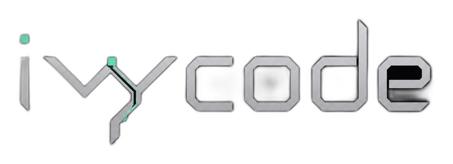
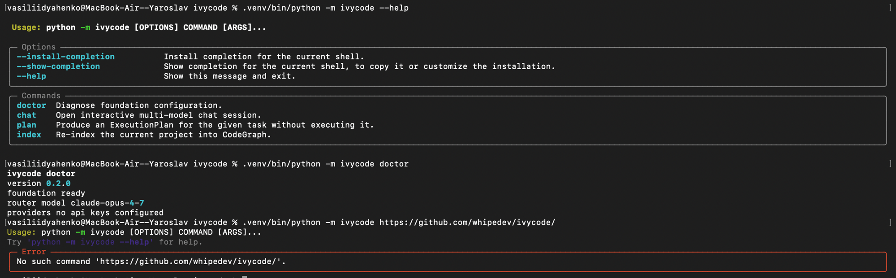
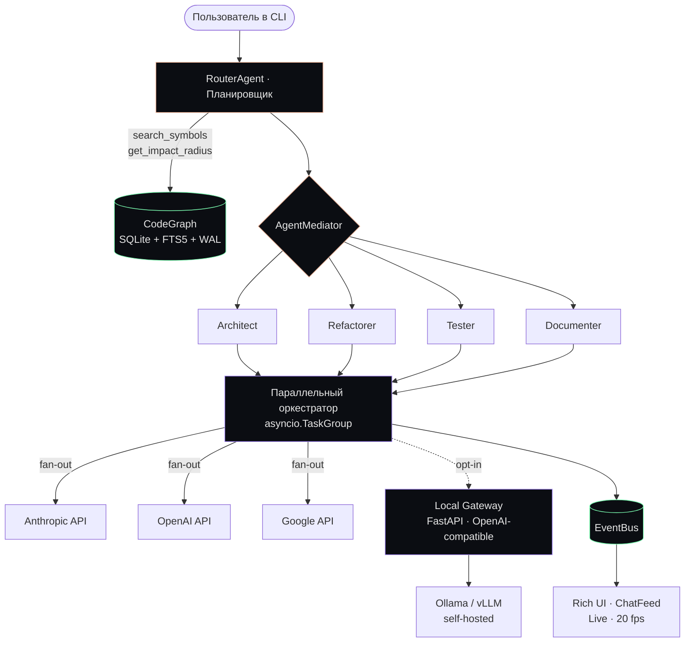

<div align="center">

<br>



<br>

<sub>Русский · [English](README.md)</sub>

<br>

**Три фронтирные модели. Один чат-фид. Ноль раздутого контекста.**

Параллельная оркестрация Claude · GPT · Gemini в одном Rich-терминале,
с локальным семантическим графом вашей кодовой базы.

<br>

[](LICENSE)
[](https://www.python.org/)
[](#-дорожная-карта)
[](PROMPT_SPEC.md)

<br>

[**Быстрый старт**](#-быстрый-старт) ·
[**Архитектура**](#-архитектура) ·
[**Дизайн-система**](#-дизайн-система) ·
[**Спека**](PROMPT_SPEC.md) ·
[**Дорожная карта**](#-дорожная-карта)

<br>

---

</div>

## Как это выглядит

Единый прокручиваемый чат-фид, в котором каждая модель — спикер со своим цветным баром, глифом и айдентикой. Параллельный стриминг без борьбы за экран и без трёхколоночного ада.

```
 ❖  ι v y c o d e
 ──────────────────────────────────────────

 project   ~/code/myapp on feat/oauth
 graph     1 247 символов · fresh
 models    ◆ claude   ▲ gpt   ● gemini


 ✦  router                                          14:32:01 · ✓ plan ready

   plan ready · 4 шага · risk=low · est 3.2k tok

   ┌─ ▸ Search · 12ms ──────────────────────┐
   │ "UserAuth" → 3 совпадения              │
   └────────────────────────────────────────┘
   ┌─ ▸ Impact · 27ms ──────────────────────┐
   │ "auth.login.authenticate" → risk 0.42  │
   └────────────────────────────────────────┘


 ▏ ◆  claude opus 4.7                                14:32:02 · ✓ done
 ▏
 ▏  Три эпицентра в auth-флоу. Порядок рефакторинга важен —
 ▏  сначала middleware, потом session refresh, потом login.
 ▏
 ▏  ┌─ python ─────────────────────────────────────────── [c] ─┐
 ▏  │  1  async def jwt_validate(req: Request) -> User:        │
 ▏  │  2      token = req.headers.get("authorization")         │
 ▏  │  3      ...                                              │
 ▏  └──────────────────────────────────────────────────────────┘
 ▏
 ▏  in 1 204 → out 318 · TTFB 412ms · $0.0042


 ▏ ▲  gpt-5.5 xhigh                                  14:32:02 · ⏳ 187t
 ▏
 ▏  Не согласен. Начинать с login-роута — у него меньше всего
 ▏  колееров, можно итерировать не ломая сессии...
 ▏

 ─────────────────────────────────────────────────────────────────────
 ◆ claude / architect  ·  graph 1247 sym · fresh  ·  ctx ████████░░░░ 42%
 > █
```

> [!NOTE]
> Pre-alpha. CLI собирается из [спеки на 25 разделов](PROMPT_SPEC.md). Визуал выше — зафиксированный дизайн, реализация в работе.

<br>

## Текущая реализация

`v0.2.0-ui-foundation` — текущий запускаемый этап.

<p align="center">
  
</p>

<sub align="center">`--help` · `doctor` · аккуратная обработка неизвестных команд — всё через Rich UI-foundation.</sub>

Сделано:

- метаданные проекта и строгая конфигурация инструментов
- неизменяемые Pydantic-контракты сообщений (envelope)
- runtime-настройки с поддержкой переменных окружения `IVYCODE_`
- минимальный Typer-entrypoint
- `ivycode doctor`
- Rich UI: design-токены, console singleton, static layout, базовая model panel

Запуск:

```bash
python -m ivycode doctor
```

Проверка:

```bash
python -m pytest -q
python -m ruff check .
python -m mypy ivycode
python -m ivycode doctor
```

<br>

## ✦ Зачем ivycode

<table>
<tr>
<td width="50%" valign="top">

### Параллельный интеллект
Стримите **Claude**, **GPT** и **Gemini** одновременно в один разговор. Сравнивайте, голосуйте, выбирайте. Оркестратор (`Router`) планирует, делегирует и агрегирует — вы читаете диалог, а не три терминала.

</td>
<td width="50%" valign="top">

### Семантический контекст, а не сырые файлы
Локальный `CodeGraph` (SQLite + FTS5 + WAL) индексирует репозиторий и за миллисекунды отвечает на `search_symbols`, `get_impact_radius`, `get_framework_routes`. Агенты получают `SymbolBrief`-ссылки — **на ~30–40% меньше входных токенов**, чем при сбросе исходников.

</td>
</tr>
<tr>
<td width="50%" valign="top">

### Один фид, три спикера
Без трёхколоночной резни. Каждый ответ — панель с цветным левым баром (`▏◆` Claude · `▏▲` GPT · `▏●` Gemini). Вертикальный чат. Подсветка синтаксиса. Markdown, который реально рендерится.

</td>
<td width="50%" valign="top">

### Настоящие инженерные примитивы
`asyncio.TaskGroup` для fan-out · `httpx.AsyncClient` с HTTP/2 pooling · Pydantic v2 strict-схемы как единственный контракт между агентами · single-writer-поток SQLite + read-pool `aiosqlite` · graceful cancellation по `Ctrl+C`.

</td>
</tr>
</table>

<br>

## ⚡ Быстрый старт

> [!WARNING]
> Pre-alpha. Команды ниже описывают целевой UX из спеки. Не всё ещё запускается — следите в [дорожной карте](#-дорожная-карта).

```bash
# установка (планируется)
pipx install ivycode

# конфигурация провайдеров (интерактивный wizard)
ivycode init

# чат с тремя моделями параллельно
ivycode chat -m claude -m gpt -m gemini

# одноразовый план без исполнения
ivycode plan "отрефактори auth-флоу под OAuth, оставь обратную совместимость"

# пересборка локального семантического графа
ivycode index --force

# диагностика провайдеров / графа / ключей
ivycode doctor
```

### В чате

| Префикс | Значение | Пример |
|---|---|---|
| `/` | Слэш-команды | `/compact`, `/pin`, `/fresh`, `/model`, `/context` |
| `@` | Пути к файлам с glob | `@src/auth/login.py`, `@src/**/*.ts` |
| `#` | Символы из CodeGraph | `#authenticate_user` |
| `!` | Shell-команда in-place | `!pytest tests/auth/` |
| `⌘P` | Command Palette (fuzzy) | сменить модель, закрепить, переиндексировать, дашборд |
| `↑/↓` | История · `Tab` сложить · `Enter` развернуть карточку тула |

<br>

## ✦ Архитектура



**Шесть слоёв с жёсткими границами:**

1. **CLI** — Typer + prompt_toolkit, маршрутизатор префиксов `/` `@` `#` `!` и palette.
2. **Агенты** — Router (планировщик) + SubAgents (Architect / Refactorer / Tester / Documenter), паттерн Mediator. Единственный контракт между ними — Pydantic-envelope.
3. **Провайдеры** — Abstract Factory + `WireCodec` на wire-протокол (`openai_chat`, `anthropic_messages`, `google_generate_content`, `openai_responses`). Один `AsyncClient` на профиль, HTTP/2 multiplexing.
4. **CodeGraph** — Facade поверх локального SQLite-индекса. Single-writer-поток + read-pool `aiosqlite`. Reindex через watchdog с debounce 300 мс.
5. **Оркестрация** — `asyncio.TaskGroup` для fan-out, structured cancellation, retry с экспоненциальным backoff через Tenacity.
6. **UI** — Rich `Layout` (чат-фид + sidebar + status bar), `Live(refresh_per_second=20)`, подписчики EventBus, `MessagePanel` на каждую модель с цветным левым баром.

Полная архитектура и Pydantic-схемы: **[PROMPT_SPEC.md](PROMPT_SPEC.md)** (25 разделов, ~3 500 строк).

<br>

## ✦ Дизайн-система

> Настроение: **Quiet Luxury Terminal**. Премиум-сдержанность, не synthwave-неон.

<table>
<tr>
<td width="33%" valign="top" align="center">

**Палитра**

```
bg.base       #0B0D12
bg.elevated   #11141B
text.primary  #E6E6E6
text.dim      #6B7280
accent.warm   #E5A98C
accent.mint   #7CFFB2
accent.violet #A78BFA
warn          #FFB070
error         #FF6B6B
```

</td>
<td width="33%" valign="top" align="center">

**Спикеры**

```
◆  Claude    #C97B5C
▲  GPT       #10A37F
●  Gemini    #8AB4F8
✦  Router    #A78BFA
✮  Graph     #7CFFB2
◈  Context   #E5A98C
⚠  Error     #FF6B6B
```

</td>
<td width="33%" valign="top" align="center">

**Голос**

Сухо. Инженерно. Факты и числа.

```
plan ready · 4 шага · risk=low
reindex 23/40 · 1.4s
ctx compacted · -3 840 tok
provider · anthropic 429
dispatch · architect · 6k tok
```

</td>
</tr>
</table>

**Плотность:** Roomy · padding `(1, 2)` · одна пустая строка между сообщениями.
**Движение:** Living · кастомные спиннеры (`ivy-pulse`, `ivy-orbit`, `ivy-stream`) · уважает `IVYCODE_MOTION=static`.
**Ввод:** `/` команды · `@` файлы · `#` символы · `!` shell · `⌘P` palette · `Tab` свернуть · `Enter` развернуть.

<br>

## ✦ Возможности

<table>
<tr>
<td width="50%" valign="top">

#### 🧠 Мультиагентная оркестрация
Router планирует через строгий Pydantic `ExecutionPlan` (валидируется, retry-ится, schema-enforced). SubAgents выполняют через Mediator. `parallel_compare` для неоднозначных решений, детерминированная диспетчеризация для рефакторов.

</td>
<td width="50%" valign="top">

#### 🗂️ Семантический CodeGraph
Локальный SQLite + FTS5 индекс каждого символа, роута, графа caller-ов. `get_impact_radius()` трассирует транзитивные зависимости. Watchdog reindex по сохранению. ~30–40% экономии токенов vs сырые файлы.

</td>
</tr>
<tr>
<td width="50%" valign="top">

#### 🎨 Rich UI с параллельным стримингом
Единый scrollable фид, модели как цветные спикеры. `Live` redraw 20 fps. Подсветка синтаксиса с действиями copy/save/run. Inline-карточки тулов. Адаптивный status-bar.

</td>
<td width="50%" valign="top">

#### 🔌 Pluggable-транспорты
Абстрактный `WireCodec` на протокол. Тот же код агентов работает с official APIs, Ollama, vLLM, LiteLLM или вашим локальным шлюзом. Кастомный `base_url` в TOML-конфиге.

</td>
</tr>
<tr>
<td width="50%" valign="top">

#### 🪟 Управление контекстом долгой сессии
Иерархическое `ContextWindow`: pinned + recent + summaries. Авто-сжатие через дешёвую быструю модель при использовании >70%. Дедупликация повторных `read_file` через CodeGraph.

</td>
<td width="50%" valign="top">

#### 🧩 Plugin-система
Opt-in плагины через manifest. Из коробки: `understand-anything` (LLM-обогащённый граф знаний + веб-дашборд). Добавляйте свои через регистрацию `@skill`-callable с JSON Schema.

</td>
</tr>
</table>

<br>

## ✦ Конфигурация

Минимальный `~/.ivycode/config.toml`:

```toml
[providers.claude]
vendor = "anthropic"
wire_protocol = "anthropic_messages"
model_id = "claude-opus-4-7"
display_name = "Claude Opus 4.7"

[providers.claude.transport]
base_url = "https://api.anthropic.com/"
auth_kind = "api_key_header"
api_key_header = "x-api-key"
api_key = { env = "ANTHROPIC_API_KEY" }

[providers.local_llama]
vendor = "ollama"
wire_protocol = "openai_chat"
model_id = "llama3.1:70b-instruct-q4_K_M"
display_name = "Llama 3.1 70B (local)"

[providers.local_llama.transport]
base_url = "http://localhost:11434/v1/"
auth_kind = "none"
verify_tls = false
timeout_s = 600
```

Затем: `ivycode chat -m claude -m local_llama` — official cloud + локальный GPU в одном фиде. Router не знает, где что.

<br>

## ✦ Local Gateway (опционально)

Встроенный FastAPI-сервер, экспонирующий единый OpenAI-compatible эндпоинт над несколькими бэкендами — полезно для централизованного rate-limit, очереди на аккаунт и переключения моделей без рестарта CLI.

```bash
ivycode gateway init
ivycode gateway serve --host 127.0.0.1 --port 7878
```

**Поддерживаемые бэкенды:** Ollama, vLLM, LiteLLM, официальные cloud API (Anthropic, OpenAI, Google), авторизованная внутренняя RPA.

**Не поддерживается принципиально:** скрейп consumer Web UI (`chatgpt.com`, `claude.ai`, `gemini.google.com`) — `AdapterRegistry` отклоняет эти хосты на старте. Нарушает ToS вендоров, ломается на каждом обновлении UI. Используйте официальные API или self-hosted Ollama/vLLM. См. **[§19 спеки](PROMPT_SPEC.md)**.

<br>

## ✦ Дорожная карта

<table>
<tr><th>Фаза</th><th>Содержание</th><th>Статус</th></tr>
<tr><td>0 · Спека</td><td>Полная production-спека, 25 разделов</td><td>✅</td></tr>
<tr><td>1 · Core</td><td><code>core/envelope.py</code>, <code>core/settings.py</code>, <code>core/runtime.py</code></td><td>🛠️</td></tr>
<tr><td>2 · UI</td><td>Rich Layout, ChatFeed, MessagePanel, status bar, темы</td><td>🛠️</td></tr>
<tr><td>3 · Провайдеры</td><td>Anthropic + OpenAI + Google адаптеры, WireCodec, Factory</td><td>⏳</td></tr>
<tr><td>4 · CodeGraph</td><td>SQLite writer thread, aiosqlite pool, watchdog, FTS5</td><td>⏳</td></tr>
<tr><td>5 · Агенты</td><td>Router + Mediator + Architect SubAgent end-to-end</td><td>⏳</td></tr>
<tr><td>6 · Оркестрация</td><td>TaskGroup fan-out, ContextWindow авто-сжатие</td><td>⏳</td></tr>
<tr><td>7 · CLI</td><td>Typer-команды, REPL, маршрутизатор слэш/@/#/!</td><td>⏳</td></tr>
<tr><td>8 · Gateway</td><td>FastAPI shim, SessionSupervisor, Ollama/vLLM адаптеры</td><td>⏳</td></tr>
<tr><td>9 · Плагины</td><td>understand-anything интеграция, plugin manifest loader</td><td>⏳</td></tr>
<tr><td>10 · Polish</td><td>Doctor, persistence, history, тесты, docs-сайт</td><td>⏳</td></tr>
</table>

<br>

## ✦ Документация

| Документ | Назначение |
|---|---|
| **[PROMPT_SPEC.md](PROMPT_SPEC.md)** | Production-спека · архитектура · Pydantic-схемы · системные промпты · дизайн-токены · gateway · плагины |
| Архитектурный deep-dive | *(скоро)* |
| Гайд по написанию плагинов | *(скоро)* |
| Voice & style guide | *(скоро, живёт в спеке §17.8)* |

<br>

## ✦ Благодарности

- **[Rich](https://github.com/Textualize/rich)** от Textualize — на нём держится весь UI-слой.
- **[Pydantic](https://github.com/pydantic/pydantic)** — каждый контракт в системе.
- **[Understand-Anything](https://github.com/Lum1104/Understand-Anything)** от Lum1104 — opt-in плагин для LLM-обогащённого графа знаний.
- **[HTTPX](https://github.com/encode/httpx)** · **[aiosqlite](https://github.com/omnilib/aiosqlite)** · **[Typer](https://github.com/tiangolo/typer)** · **[prompt_toolkit](https://github.com/prompt-toolkit/python-prompt-toolkit)** · **[Tenacity](https://github.com/jd/tenacity)** — тихие рабочие лошадки.

<br>

## ✦ Лицензия

[GPL-3.0](LICENSE) © 2026 — сделано для инженеров, которые отказываются ждать.

<br>

<div align="center">

```

   ❖   когда три модели спорят, ты выкатываешь быстрее

```

</div>
